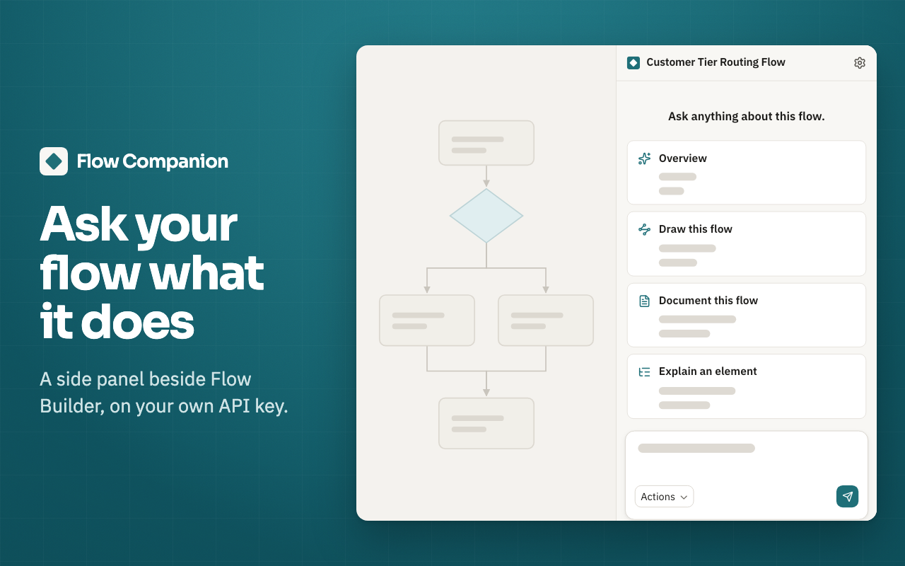

# Flow Companion for Salesforce

[](https://chromewebstore.google.com/detail/flow-companion-for-salesf/gfhjeefdbhangjmilchdaofkldipgbcn) [](./LICENSE) [](https://github.com/johncharlesworth/flow-companion/actions/workflows/ci.yml)

Flow Companion is a Chrome extension that explains the Salesforce flow you have open in Flow Builder. It opens in Chrome's side panel and answers your questions with the AI model you choose, using your own API key from Anthropic, OpenAI, or Google.

**[Add to Chrome](https://chromewebstore.google.com/detail/flow-companion-for-salesf/gfhjeefdbhangjmilchdaofkldipgbcn)** · [Website](https://getflowcompanion.com) · [Docs](https://getflowcompanion.com/docs/) · [Privacy policy](https://getflowcompanion.com/privacy)



## What it does

Ask anything about the open flow, such as "Where could this flow go wrong?" or "What should someone know before changing this flow?" Or start with one of four actions:

- **Overview.** The whole flow summarized: its purpose, trigger, main paths, what it updates, and any external calls.
- **Draw this flow.** The main paths as one flowchart in plain language. Open it in Excalidraw to edit it, or copy the Mermaid text.
- **Document this flow.** The full write-up, with resource tables, a walkthrough in execution order, a decision matrix, and data operations. Copy it or download it as Markdown.
- **Explain an element.** Pick any element and get its inputs, its exact conditions and formulas, its outcomes, and its fault path.

The same actions are in the **Actions** menu in the message box. There, Draw comes in three versions: **Draw main paths**, **Draw one element** (the element you pick and what's around it), and **Draw every element** (each element by its API name).

You can also:

- **Set how it answers.** In Settings, under **Answers**, add standing instructions such as "Use field labels, not API names." or "Answer in Portuguese." Set **Detail** to Concise, Balanced, or Thorough.
- **Pick the model.** Use any model your key can use. Switch from the model's name in the message box, even mid-chat.
- **Keep your chats.** Each flow's chat is saved on your computer and stays when you save a new version of the flow. **New chat** starts over.
- **Save the flow's JSON.** Choose **Download JSON** from the panel's **⋮** menu.
- **Try a demo flow.** You need no key and no Salesforce org. Click **See it on a demo flow first** on the panel's first screen, or **Try a demo flow** at the bottom of Settings. Its four actions play answers recorded from Claude Sonnet 5.

## What you need

- Chrome 114 or later.
- A Salesforce org where your profile has **API Enabled** and **View Setup and Configuration**. Sandboxes and production both work, and nothing is installed in the org.
- An API key from [Anthropic](https://console.anthropic.com/settings/keys), [OpenAI](https://platform.openai.com/api-keys), or [Google AI Studio](https://aistudio.google.com/apikey). A Claude, ChatGPT, or Gemini chat subscription is not an API key.

The extension is free. Your provider bills you for what you use, at its own rates.

## How to use it

1. [Add Flow Companion to Chrome](https://chromewebstore.google.com/detail/flow-companion-for-salesf/gfhjeefdbhangjmilchdaofkldipgbcn).
2. Open a flow in Flow Builder.
3. Click the Flow Companion icon in Chrome's toolbar. If you don't see it, pin it from the Extensions menu (the puzzle-piece icon).
4. The first time, click **Set up your AI**, choose Anthropic, OpenAI, or Google, and paste your API key. The panel checks the key and saves it.
5. Click **Start chatting**, then ask a question or pick one of the four actions.

The panel follows your tab. Open another flow and the panel reads that one.

## What is sent, and where

Flow Companion has no server, no account, no telemetry, and no analytics. Nothing you do in it reaches me. It connects only to your org's `*.my.salesforce.com` host and to the AI providers you add a key for: `api.anthropic.com`, `api.openai.com`, and `generativelanguage.googleapis.com`. Chrome blocks any connection outside Salesforce and those three.

- **Your Salesforce org.** The panel uses the Salesforce session already in your browser to read the flow's last saved metadata from your org's API. The session goes only to your org's `*.my.salesforce.com` host and is never stored.
- **Your AI provider**, under your key:
  - When you ask a question or use an action: the flow's saved metadata, your question, the chat so far, and the instructions you wrote under **Answers** in Settings.
  - When Anthropic or Google is your provider, each time a flow opens or you switch models: the flow's saved metadata, to check that it fits the model. With OpenAI, that check happens on your computer.
  - When your key is checked, and at most once a day after that when the panel opens: the key alone, to get the list of models it can use.

The flow's metadata is its definition: element names and labels, conditions, formulas, text templates, descriptions, and how the elements connect. Flow Companion doesn't read records from your org, and it sends nothing from your other tabs. The flow is sent as data, and the AI model is told to ignore any instructions written inside it.

What your provider receives falls under its own privacy policy: [Anthropic](https://www.anthropic.com/privacy), [OpenAI](https://openai.com/policies/privacy-policy), [Google](https://policies.google.com/privacy). On Google's free tier, prompts may be used to improve Google's models. Use a paid project if that matters for your org.

Your API key is stored in Chrome on your computer and goes only to its provider. Turn off **Remember this key on this computer** and Chrome forgets the key when it closes. **Forget everything on this computer**, at the bottom of Settings, removes your keys, settings, and chats.

The demo flow sends nothing.

**Open in Excalidraw** puts the picture on your clipboard and opens excalidraw.com in a new tab. Nothing goes to Excalidraw until you paste it there.

Details: [Privacy and security](https://getflowcompanion.com/docs/privacy-and-security) · [Privacy policy](https://getflowcompanion.com/privacy)

## Limits

- Orgs that use API Access Control, and orgs behind Microsoft Defender for Cloud Apps, aren't supported.
- Flow Companion reads the last saved version of a flow. Save your changes, then click the **Refresh** icon at the top of the panel before you ask about them.
- Answers and pictures cover this flow's saved definition only. They don't include what's inside its subflows, other automation, or your org's records.
- If the flow and the chat so far are too big for the chosen model, the panel won't send your question. It names a model that can read the flow, or another provider to try.
- Your provider's rate limits apply.
- Firefox isn't supported.
- Two Chrome windows on the same flow share one chat history.
- Flow Companion never edits a flow, and it doesn't scan flows against a fixed set of rules.

## Help and bugs

- **Questions:** see the [docs](https://getflowcompanion.com/docs/) or email me at support@getflowcompanion.com.
- **Bugs and ideas:** [open an issue](https://github.com/johncharlesworth/flow-companion/issues). Include the extension version (shown on `chrome://extensions`), your Chrome version, the provider and model, and what the panel said. Never paste a real flow or record data into an issue.
- **Security problems:** email me at support@getflowcompanion.com instead of opening an issue. See [`SECURITY.md`](./SECURITY.md).

## Build from source

You need Node 24 (or 22.18 or later) and npm.

```bash
git clone https://github.com/johncharlesworth/flow-companion.git
cd flow-companion/extension
npm install
npm run build
```

Open `chrome://extensions`, turn on **Developer mode**, click **Load unpacked**, and choose `extension/.output/chrome-mv3/`. Commands, tests, and the code layout are in [`extension/README.md`](./extension/README.md). To contribute, see [`CONTRIBUTING.md`](./CONTRIBUTING.md).

## License

Copyright (C) 2026 Charlesworth Holdings LLC. Licensed under [GPL-3.0](./LICENSE). The license doesn't cover the Flow Companion name or logo; see [`TRADEMARKS.md`](./TRADEMARKS.md).

Salesforce and Flow Builder are trademarks of Salesforce, Inc. Flow Companion is an independent product and is not affiliated with or endorsed by Salesforce.
